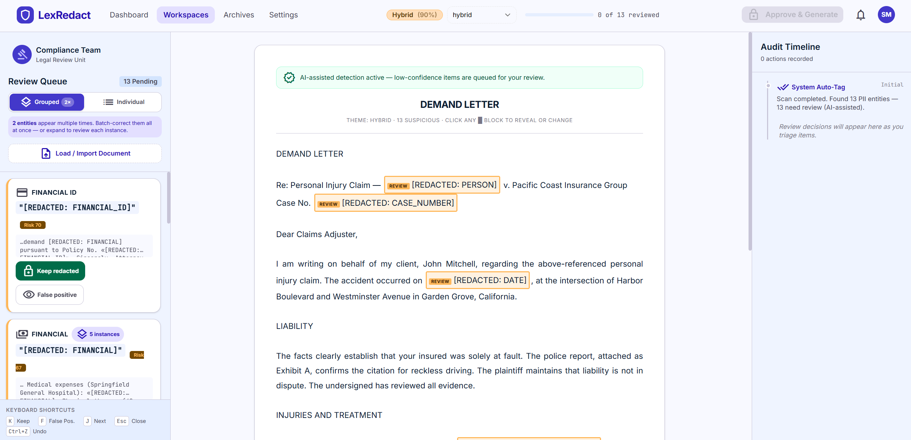
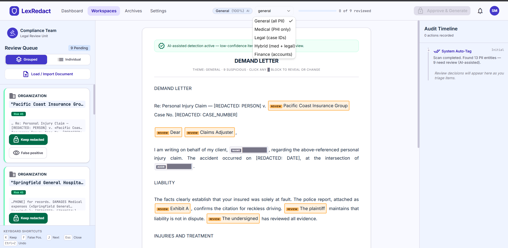
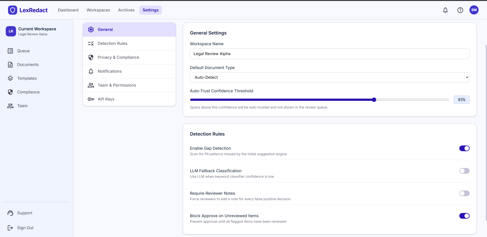
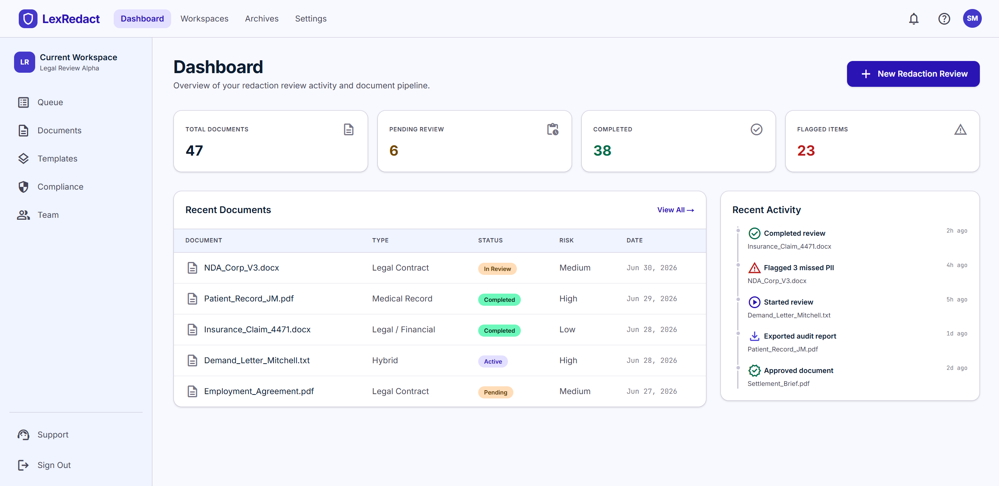

# LexRedact — Sam's Redaction Correction Tool

> **Sprintfour Hackathon · Problem Statement 3: Fixing the tool's mistakes**

A full-stack Next.js application built for the exact scenario where a PII redaction tool gets it wrong — hiding harmless boilerplate while leaving a real phone number and a real name untouched — and the reviewer moving fast doesn't catch either mistake.

---

## Live Demo

**[https://sprint4hack-vimal.onrender.com](https://sprint4hack-vimal.onrender.com)**

> Free-tier cold start: if the page loads blank, wait 20–30 seconds and refresh once.

---

## Demo Video

**[Watch the full walkthrough on Google Drive](https://drive.google.com/drive/folders/1RK90YvfZXxjfcZCPq44vH_fAT3s5TIxb?usp=sharing)**

> **Note:** The video was recorded while the Gemini free-tier quota was being hit mid-session (50 req/day limit). You may see the amber "AI detection unavailable" fallback banner in parts of the video — this is graceful degradation working as designed, not a bug. The **live deployment** above has a fresh API key and runs full Gemini detection end-to-end. Use the live app for the clearest demonstration.

---

## Screenshots

### Review Workspace — Hybrid Document with Entity Grouping



The main review workspace loaded with a demand letter classified as **Hybrid (90%)** — both medical and legal PII in scope. The left queue shows the **Grouped view** with a "2×" batch badge, meaning 2 entities appear multiple times in the document. The purple hint banner reads *"2 entities appear multiple times. Batch-correct them all at once."* The FINANCIAL group shows **5 instances** — Sam sees this count before making any decision. The document viewer shows amber `REVIEW` blocks inline, and the green banner confirms AI-assisted detection is active with low-confidence items queued for human review.

---

### Novel Feature — Document Theme Switcher



The **theme switcher** in the header dropdown lets Sam change the redaction scope mid-review without reloading the document. Switching theme triggers a full Gemini re-scan scoped to that domain's rules:

| Theme | What gets redacted |
|---|---|
| **General (all PII)** | Everything — names, phones, emails, dates, financials, diagnoses |
| **Medical (PHI only)** | Patient names, diagnoses, physician names, dates of care, medical facility names |
| **Legal (case IDs)** | Party names, case numbers, policy numbers, settlement amounts, attorney contacts |
| **Hybrid (med + legal)** | Both PHI and legal identifiers — for demand letters, insurance claims |
| **Finance (accounts)** | SSNs, account numbers, routing numbers, transaction amounts only |

This screenshot shows the same demand letter switched from Hybrid to **General (100%)** — notice the document viewer now flags `Dear`, `Claims Adjuster`, `Exhibit A`, `The plaintiff`, and `The undersigned` as amber review blocks because the General scope is maximally inclusive. The review queue changed from 13 to 9 items as Gemini rescoped its detection. **No other redaction tool in this class lets the reviewer change the scope mid-session and instantly see the difference.**

---

### Settings — Detection Rules & Confidence Threshold



The **Settings** panel exposes the controls that govern how aggressively the system routes items to the human queue:

- **Auto-Trust Confidence Threshold (85%)** — the slider that decides what gets auto-redacted vs queued for Sam. Set lower (e.g. 70%) to send more to the queue; higher (e.g. 95%) to auto-trust more. This is the key dial for tuning alert fatigue vs risk tolerance.
- **Enable Gap Detection (ON)** — second-pass scan that finds PII the original tool missed entirely. This is what catches the phone number and name PS3 describes.
- **LLM Fallback Classification (OFF)** — when enabled, Gemini is used for document classification when keyword scoring is uncertain.
- **Require Reviewer Notes (OFF)** — when enabled, Sam must type a reason for every false positive decision, not just tap a quick-tag.
- **Block Approve on Unreviewed Items (ON)** — enforces that every flagged item has a decision before the document can be exported. Prevents Sam from clicking Approve before finishing the queue.

---

### Dashboard — Document Pipeline Overview



The **Dashboard** gives a workspace-level view of the redaction pipeline — not just the current document. Key stats: 47 total documents processed, 6 pending review, 38 completed, 23 flagged items across all documents. The Recent Documents table shows mixed document types (Legal Contract, Medical Record, Legal/Financial, Hybrid) with risk levels and statuses. The Recent Activity feed on the right shows a live audit trail: *"Flagged 3 missed PII — NDA_Corp_V3.docx"*, *"Exported audit report — Patient_Record_JM.pdf"*, *"Approved document — Settlement_Brief.pdf"*. This makes the system usable beyond a single document — Sam can track his entire day's workload from one screen.

---

## The Problem

Sam is reviewing a tool's suggested redactions. The tool has hidden a few things that are not sensitive at all, and, worse, it has left a phone number and a name untouched. Sam is moving fast and trusts the tool a little too much. The mistakes that slip through are the ones he does not stop to look at.

The standard solution — show Sam every flagged item one at a time — misses the actual failure mode. Sam doesn't miss items because there are too many to click. He misses them because he makes one decision and assumes it applies everywhere. When "John Mitchell" appears five times and he confirms one instance, four slip through without a second thought.

---

## What Makes This Different

Most submissions to PS3 will build the same thing: an LLM flags items at varying confidence levels, low-confidence ones go into a review queue, human clicks through them. That is the obvious interpretation of "human in the loop."

LexRedact is built around a different question: **not whether Sam sees each item, but whether he understands he is seeing all of it.**

---

## Novel Features

### 1 — Entity Grouping with Batch Correction

When "John Mitchell" appears five times in a document, five separate queue items is the wrong UI. Sam reviews the first one, feels done, and moves on. This is the mechanism behind the PS3 failure mode.

Entity Grouping makes the count impossible to miss:

- All spans sharing the same text and PII type are bucketed into **one group card**
- A **"× N instances"** badge surfaces immediately
- **"Redact all N"** / **"False positive — all N"** apply the decision across every occurrence in one click
- A **confirmation dialog** fires first — the count is shown again before applying
- **"Review individually"** expands the group to show each occurrence with surrounding sentence context

### 2 — Document Theme Switching (Mid-Review Rescoping)

The redaction scope should match the document's purpose, not be a fixed global setting. LexRedact lets Sam switch between five themes at any point during review:

- **General** — all PII types, maximum coverage
- **Medical** — PHI only: patient names, diagnoses, physician names, care dates
- **Legal** — judicial identifiers: case numbers, party names, policy numbers, settlement amounts
- **Hybrid** — both medical and legal in scope (demand letters, insurance claims)
- **Finance** — financial identifiers only: SSNs, account numbers, transaction amounts

Each switch triggers a full Gemini re-scan under the new scope. The document viewer updates in place — no reload, no re-upload. This directly prevents a class of false positives that exist because the wrong scope was applied: a legal boilerplate phrase flagged under General is correctly ignored under Legal.

### 3 — Context Snippets Per Queue Item

Every item shows the surrounding sentence, not just the bare text:
```
…arising from the injury of «John Mitchell», who was transported…
```
Sam judges sensitivity from context without scrolling to find it in the document.

### 4 — Structured Exemption Codes

One-tap tags at the correction step write machine-readable codes into the audit log:

| Code | Meaning |
|---|---|
| `FP-LEGAL-TERM` | Legal boilerplate |
| `FP-COMMON-NAME` | Common name / word |
| `FP-JOB-TITLE` | Job title / role |
| `FP-ORG-NAME` | Organisation (not PII) |
| `MP-CONTEXT` | Missed PII by context |
| `MP-PHONE` | Missed phone / contact |

Every decision is now queryable — not just "Sam said no" but exactly why.

### 5 — "What Your Review Caught" Summary

The final dialog shows a post-review breakdown: missed PII you caught, false positives you unblocked, decisions logged with exemption codes. Sam can prove his review was thorough, not just that he clicked Approve.

---

## How LexRedact Compares

| Capability | Standard HITL tool | LexRedact |
|---|---|---|
| PII detection | Flags items, assigns confidence | Gemini primary + regex gap-scan for missed PII |
| Review queue | One item at a time | Grouped by entity — "× N instances" badge |
| Multi-instance handling | Reviewer decides each separately | Batch action with confirmation guard |
| Context per item | Bare redacted text | Surrounding sentence with span highlighted |
| Redaction scope | Fixed global setting | 5 switchable themes, Gemini rescans on change |
| False positive logging | Binary yes/no | Structured exemption codes (machine-readable) |
| End-of-review feedback | None | "What your review caught" — missed PII + FP count |
| Undo | Usually absent | Ctrl+Z reverts last correction |
| AI failure handling | Error or crash | 4-model fallback chain + amber UI banner |

---

## Quick Start

```bash
npm install
npm run dev
```

Open [http://localhost:3000](http://localhost:3000).

Create `.env.local`:
```
GEMINI_API_KEY=your_key_here
```

Get a free key at [aistudio.google.com](https://aistudio.google.com).

---

## Core Workflow

1. **Upload** — plain text, JSON with pre-annotated suggestions, inline `{{TYPE:conf}}` markers, or bracket `[[TYPE] text [label]]` markers
2. **Classify** — Gemini identifies document type; keyword scoring as immediate fallback
3. **Detect** — Gemini finds PII per item with confidence score and false-positive risk flag
4. **Auto-redact** — items ≥ 78% confidence hidden immediately as `████` blocks
5. **Gap scan** — second pass finds PII the original suggestions missed; red "Not Redacted" items at top of queue
6. **Review** — grouped entity cards, context snippets, theme switching, exemption codes, keyboard shortcuts
7. **Approve** — unlocks only when every flagged item has a decision
8. **Export** — redacted text + full audit JSON with every decision, timestamp, and exemption code

---

## Architecture

```
src/
├── app/
│   ├── api/
│   │   ├── process-document/        ← POST: classify + Gemini detect + gap scan
│   │   └── reprocess-theme/         ← POST: re-detect under a specific theme
│   └── page.tsx
├── components/
│   ├── ReviewWorkspace.tsx           ← Orchestrator
│   ├── correction/CorrectionPanel.tsx       ← Keep / FP / exemption code quick-tags
│   ├── document-viewer/DocumentViewer.tsx   ← Inline highlights + AI status banner
│   ├── final-output/FinalDocumentDialog.tsx ← Export + "What your review caught"
│   ├── layout/AppHeader.tsx                 ← Progress, theme badge, Undo, Approve
│   └── review-queue/
│       ├── GroupedReviewItem.tsx    ← Entity group card with batch actions
│       └── ReviewQueueItem.tsx      ← Single span with context snippet
├── hooks/useReviewState.ts          ← Reducer + async pipeline + undo
└── lib/
    ├── entity-grouper.ts            ← Groups spans, extracts context snippets
    ├── document-parser.ts           ← Plain text / JSON / inline / bracket formats
    └── detection/
        ├── llm-client.ts            ← Gemini with 4-model fallback chain
        ├── gap-detection.ts         ← Scans for PII missed by suggestions
        ├── risk-rules.ts            ← Domain-weighted risk score per PII type
        └── theme-filter.ts          ← Scopes spans to document theme
```

---

## Testing

```bash
# Full edge-case test suite (12 tests)
node test-documents/run-tests.mjs

# Backend API tests
node scripts/test-backend.mjs
```

| Test file | Covers |
|---|---|
| `01-ps3-core-scenario.json` | **Primary PS3 demo** — FP boilerplate + missed phone + missed name |
| `02-repeated-entity.txt` | Same entity 9×, entity grouping badge |
| `03-all-auto-trusted.txt` | Zero review queue, approve immediately |
| `04-all-needs-review.txt` | Heavy queue, low-confidence everything |
| `05-clean-no-pii.txt` | No PII, approve with 0 spans |
| `06-medical-missed-pii.json` | Missed phone × 2 + contact name × 2 |
| `07-legal-fp-heavy.json` | 8 boilerplate false positives |
| `08-inline-markers.txt` | `{{TYPE:conf}}` format parser |
| `09-bracket-markers.txt` | `[[TYPE] text [lbl]]` format parser |
| `10-long-document.txt` | 800+ words, 76 spans, zero overlaps |
| `11-finance-mixed.txt` | SSN, account numbers, names |
| `12-overlapping-spans.json` | 13 overlapping suggestions → 12 clean spans |

---

## Design Decisions

**Why auto-trust high-confidence items?**
Asking Sam to confirm every obvious SSN causes alert fatigue — the precise condition that makes him stop looking. The 78% threshold is calibrated so only genuinely ambiguous items reach the queue.

**Why entity grouping as the primary novel feature?**
PS3 says "mistakes slip through because he does not stop to look at them." The multi-instance case is the primary mechanism: one decision made, remaining instances invisible. Grouping makes the count the first thing Sam sees.

**Why five switchable themes instead of one detection mode?**
The same document scanned under "General" (all PII) vs "Legal" (case IDs only) produces a completely different review queue. A legal boilerplate phrase is a false positive under General, correctly ignored under Legal. Forcing Sam to work under the wrong scope creates unnecessary review load and erodes trust in the tool.

**Why structured exemption codes?**
Binary audit logs are not useful downstream. Machine-readable codes like `[FP-LEGAL-TERM]` are queryable, trainable, and auditable. They also make Sam articulate why he is making a decision, which reduces careless clicking.

**What was not built:**
- Multi-document batch processing (PS2)
- Trust and explainability UI (PS1)
- Database persistence (session state only)
- PDF text extraction
